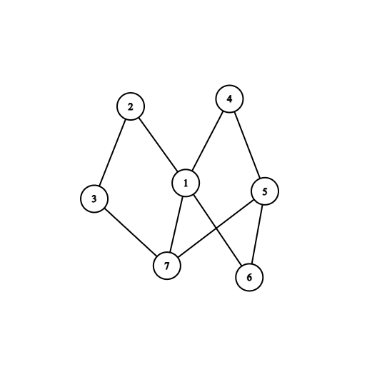
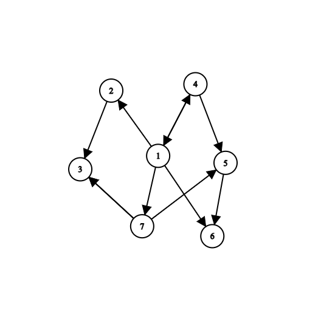
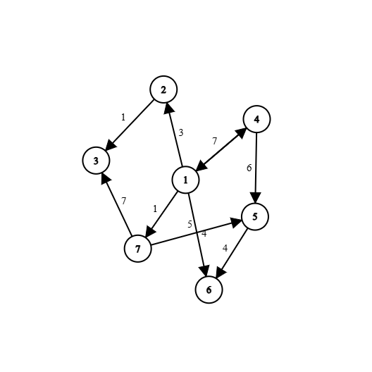
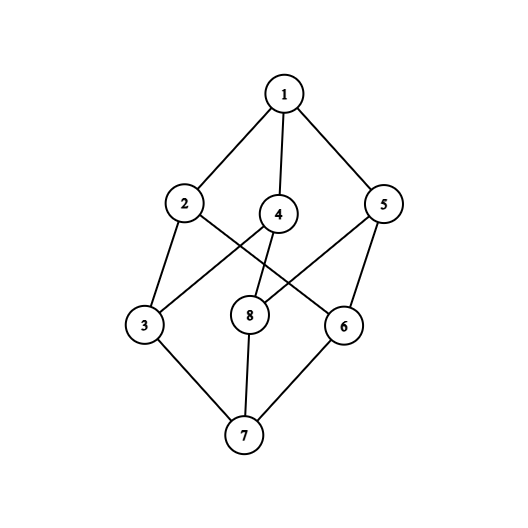
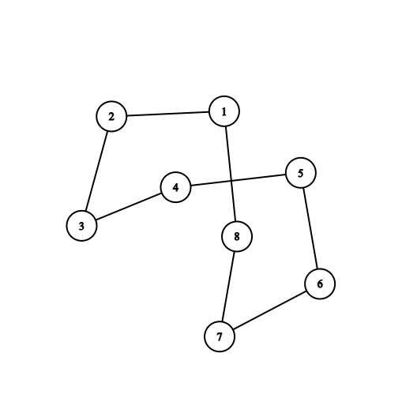

# Graph Theory 

# 1. Formal Definition of a Graph

A graph is defined as a pair:

$$
G = (V, E)
$$

where:
- $V$ is the set of vertices (nodes)
- $E \subseteq V \times V$ is the set of edges

## Undirected graph

An edge is an unordered pair:

$$
(u, v) = (v, u)
$$

## Directed graph

An edge is an ordered pair:

$$
(u, v) \ne (v, u)
$$

---

# 2. Types of graphs

- Undirected graph
- Directed graph
- Weighted graph
- Unweighted graph
- Cyclic graph
- Acyclic graph
- Tree (connected acyclic graph)
- DAG (Directed Acyclic Graph)

---

# 3. Graph representation

## Adjacency list (unweighted)
```cpp
vector<int> adj[N];
```
## Adjacency list (weighted)

```cpp
vector<pair<int,int>> adj[N];
```
Where: 
```cpp
- first = neighbor node
-  second = edge cost
```

## Adjacency matrix
```cpp
int g[N][N];
```
## Edge list
```cpp
struct Edge {  
int a, b, c;  
};  
vector<Edge> edges;
```
---

# 4. Graph Examples

## Undirected Graph



---

## Directed Graph



---

## Weighted Graph



---

# 5. BFS (Breadth First Search)

Definition:
Traversal that explores nodes level by level using a queue.

Used for:
- shortest path in unweighted graphs
- connected components

### Complexity

$$
O(N + M)
$$

---

# 6. DFS (Depth First Search)

Definition:
Traversal that explores as deep as possible before backtracking.

Used for:
- connected components
- cycle detection
- topological sorting

### Complexity

$$
O(N + M)
$$

---

# 7. Shortest path algorithms

## Dijkstra

Single-source shortest path algorithm (non-negative weights only).

### Complexity

$$
O((N + M)\log N)
$$

---

## Bellman–Ford

Single-source shortest path algorithm.

- supports negative weights
- detects negative cycles

### Complexity

$$
O(N \cdot M)
$$

---

## Floyd–Warshall (Roy–Floyd)

All-pairs shortest path algorithm.

### Formula
$$
dist[i][j] = \min(dist[i][j],\; dist[i][k] + dist[k][j])
$$


### Complexity

$$
O(N^3)
$$

---

# 8. Minimum Spanning Tree (MST)

## Prim’s algorithm

Grows a tree by always choosing the minimum edge that connects a new node.

### Complexity

$$
O((N + M)\log N)
$$

---

## Kruskal’s algorithm

Sorts edges and adds them if they do not form a cycle (using DSU).

### Complexity

$$
O(M \log M)
$$

---

# 9. Connected components

Used in undirected graphs.

Methods:
- DFS
- BFS

### Complexity

$$
O(N + M)
$$

---

# 10. Strongly Connected Components (SCC)

## Kosaraju algorithm

Steps:
1. DFS and store finishing order
2. Transpose graph
3. DFS in reverse order

### Complexity

$$
O(N + M)
$$

---

## Tarjan algorithm

Uses DFS, stack, and low-link values.

### Complexity

$$
O(N + M)
$$

---

# 11. Topological sorting

Used only for DAGs.

Condition:
If $u \to v$, then $u$ must appear before $v$.

Methods:
- DFS-based
- Kahn’s algorithm (BFS + indegree)

---

# 12. Additional graph concepts

## Degree of a node

Undirected:
- number of incident edges

Directed:
- indegree
- outdegree

---

## Path and cycle

Path: sequence of connected nodes

Cycle: path that starts and ends at the same node

---

## DAG

Directed acyclic graph with no cycles.

Used for:
- dependencies
- scheduling
- topological ordering

---

# 13. Articulation points and bridges

## Articulation point
A node whose removal increases number of connected components.

## Bridge
An edge whose removal increases number of connected components.

---

# 14. Complexity summary

| Algorithm       | Complexity |
|----------------|------------|
| BFS / DFS      | $O(N + M)$ |
| Dijkstra       | $O((N + M)\log N)$ |
| Bellman-Ford   | $O(N \cdot M)$ |
| Floyd-Warshall | $O(N^3)$ |
| Prim           | $O((N + M)\log N)$ |
| Kruskal        | $O(M \log M)$ |
| Kosaraju       | $O(N + M)$ |
| Tarjan         | $O(N + M)$ |

# 15. Bipartite Graphs  
  
A graph is called bipartite if its vertex set can be split into two disjoint sets:  
  
$$  
V = L \cup R,\quad L \cap R = \varnothing  
$$  
  
such that every edge connects a node from L to a node from R.  
  
Equivalently:  
- there are no edges between nodes of the same set  
- the graph can be colored using exactly 2 colors  
  
---  

## Key properties  
  
- A graph is bipartite if and only if it contains no odd-length cycle.  
- Bipartite graphs are 2-colorable.  
- Trees are always bipartite.  
- Even cycles are bipartite, odd cycles are not.  
  
---  
  
## How to check if a graph is bipartite  
  
### Graph coloring (DFS/BFS)  
  
We assign one of two colors to each node while traversing the graph:  
- start from any node with color 0  
- neighbors must have opposite color  
- if a conflict appears → graph is not bipartite  
  
Core idea:  
- BFS/DFS traversal  
- alternating colors along edges  
- detect contradictions  
  
---  
  
### BFS level parity  
  
We can interpret bipartite structure as:  
- all nodes at even distance from start → set A  
- all nodes at odd distance → set B  
  
Core idea:  
- run BFS from every unvisited node  
- assign levels (distance from source)  
- check if an edge connects same parity levels → invalid  
  
---  

### Graph coloring
  
```cpp  
int color[N]; // -1 = unvisited, 0 / 1 = two colors
```
---  
  
## Important notes  
  
- Works only for undirected graphs  
- Must run on every connected component  
- Time complexity:  
  
$$  
O(N + M)  
$$

# 16. Eulerian Graphs

A graph is Eulerian if it contains a trail or cycle that uses every edge exactly once.

---

## Types

### Eulerian cycle
A cycle that starts and ends in the same node and uses every edge exactly once.

### Eulerian path
A path that uses every edge exactly once, but does not necessarily return to the start.

---

## Conditions

### Undirected graph

A graph has an Eulerian cycle if:
- the graph is connected (ignoring isolated nodes)
- every vertex has even degree

A graph has an Eulerian path if:
- exactly 0 or 2 vertices have odd degree

---

### Directed graph

A graph has an Eulerian cycle if:
- for every vertex: indegree = outdegree
- all vertices with non-zero degree belong to one connected component

A graph has an Eulerian path if:
- exactly one vertex has outdegree = indegree + 1
- exactly one vertex has indegree = outdegree + 1
- all others have indegree = outdegree

---

## Example



---

## Detection

- degree checking
- connectivity check (DFS/BFS)

```cpp id="eul1"
bool isEulerian(int n)
{
    int odd = 0;

    for(int i = 1; i <= n; i++)
        if(deg[i] % 2 == 1)
            odd++;

    return (odd == 0 || odd == 2);
}
```
Complexity:
  
$$  
O(N + M)  
$$

# 17. Hamiltonian Graphs  
  
A graph is Hamiltonian if it contains a path or cycle that visits every vertex exactly once.  
  
---  
  
## Types  
  
### Hamiltonian cycle  
A cycle that visits every node exactly once and returns to the starting node.  
  
### Hamiltonian path  
A path that visits every node exactly once.  
  
---  
  
## Important fact  
  
Unlike Eulerian graphs:  
- there are no simple necessary and sufficient conditions  
- deciding Hamiltonian existence is NP-complete  
  
---  
  
## Example  
  
  
  
---  

## Detection
 
- we try to build a path that visits all nodes  
- we use backtracking (DFS style)  
- we mark nodes as visited  
- we try all possible continuations  
    
```cpp id="hamiltonian1"  
bool vis[N];  
  
bool dfs(int node, int cnt, int n)  {  
	if(cnt == n)  
	return true;  
	  
	for(int v : adj[node])  {  
		if(!vis[v])  {  
		vis[v] = true;  
		if(dfs(v, cnt + 1, n))  
			return true;  
	  
		vis[v] = false;  
	}  
}  
  
return false;  
}
```
Complexity:

$$
O(N!)
$$

Worst-case exponential backtracking.